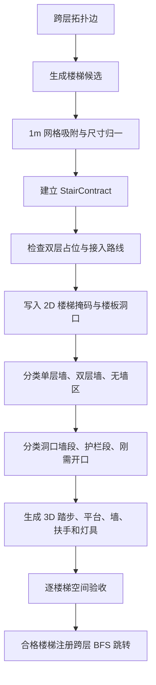

# 楼梯 PCG 生成规则与代码说明

> 适用项目：`threejs-procedural-dungeon`；当前实现版本：2026-07-20；范围：直跑楼梯、L 型楼梯、2D 生成与编辑、楼板开洞、墙体与护栏、3D 程序化模型、逐楼梯验收。

## 1. 结论

本项目的楼梯不是在房间生成完成后临时摆放的 3D 模型，而是一份跨越相邻两层的空间契约。契约先确定位置、方向、宽度、梯段、平台、净空、洞口、墙体和接入路线，再同时写入 2D 网格与 3D 渲染数据。

核心强制规则如下：

1. 楼梯只能连接相邻楼层，禁止普通楼梯跨越两层或更多楼层。
2. 楼梯摆放位置和宽度都使用 `1m` 地砖卡尺。
3. 当前只支持 `straight` 直跑和 `l-turn` L 型两种样式。
4. 楼板洞口只开在上层，并且只开净空真正穿过上层楼板的格子。
5. 开洞使用严格条件：`踏步标高 < 上层标高` 且 `踏步标高 + 2.5m > 上层标高`。
6. 上层落脚入口和梯段进入紧缩洞口的净空入口都是刚需开口，必须无墙、无横向护栏。
7. 除刚需开口外，每条暴露边必须且只能归属实体墙或护栏之一。
8. L 型楼梯的内凹转角和平台衔接边必须保持开放，禁止生成横墙或横杆。
9. 每部楼梯生成后独立检查通行、墙体、护栏和上下层洞口；单部楼梯不合格时，不允许它参与跨层连通计算。

## 2. 总体生成流程



规则的唯一数据源是楼梯连接器。2D、3D 和验证模块只能消费这份契约，不允许根据最终画面或邻格状态重新猜测楼梯结构。

## 3. 核心参数

| 参数 | 当前值 | 说明 | 代码位置 |
| --- | ---: | --- | --- |
| `FLOOR_HEIGHT` | `5m` | 相邻楼层标高差 | `src/generation/multifloor.js` |
| `STAIR_REQUIRED_HEADROOM` | `2.5m` | 人物净空 | `src/generation/multifloor.js` |
| `stepRise` | `0.25m` | 当前每级高度 | `placeConnector()` |
| `stepCount` | `20` | `5 / 0.25`，当前标准楼梯级数 | `placeConnector()` |
| `STAIR_PLACEMENT_GRID` | `1m` | 锚点、移动、旋转后的坐标卡尺 | `src/domain/stair-contract.js` |
| `STAIR_WIDTH` | `1～5m`，步长 `1m` | 楼梯宽度及拖拽缩放卡尺 | `src/domain/stair-contract.js` |
| `landingDepth` | 默认 `2m` | 上下接入平台深度 | `placeConnector()` |
| 自动楼梯默认梯跑 | 当前通常 `10m` | `ceil(5 / 0.5)`，最短不低于 `6m` | `placeConnector()` |
| 编辑器直接放置梯跑 | 默认 `8m` | 用户创建楼梯时的初始长度 | `directStairPlacement()` |

直跑楼梯使用一条梯跑；L 型楼梯把总长度拆成两段，每段至少 `3m`。L 型转向顺序是顺时针：`east → south → west → north → east`。

## 4. StairContract 数据集合

以下集合必须区分，不能把它们都理解为“楼梯占地”。

| 字段 | 含义 | 主要用途 |
| --- | --- | --- |
| `sharedFootprintCells` | 覆盖完整楼梯间的轴对齐矩形包络 | 在上下层同步预留，防止其他楼梯连接器重叠；矩形空角不自动变成地板、墙或洞口，普通走廊仍可使用不属于实际梯段/净空的填充角 |
| `stairwellInteriorCells` | 真实直跑/L 型楼梯间内部 | 清理会切断楼梯的墙体，生成真实楼梯空间 |
| `shaftCells` / `stairFootprintCells` | 梯段和转角平台的实际平面投影 | 下层踏步占地、碰撞与通行检查 |
| `headroomCells` | 完整移动净空的平面投影 | 判断天花、灯具、墙体是否侵入楼梯净空 |
| `sweptClearanceCells` | 每格记录 `treadElevation`、`clearanceTop`、`intersectsUpperSlab` | 从真实踏步高度推导楼板洞口 |
| `slabOpeningCells` / `openingCells` / `floorOpeningCells` | 上层真正需要开洞的格子 | 写入上层 `slabOpening` 和 `VOID` |
| `lowerLandingCells` / `upperLandingCells` | 上下落脚区 | 保证梯段与楼层地面连续 |
| `lowerApproachCells` / `upperApproachCells` | 落脚区加定向 Gate | 防止走廊从楼梯侧面接入 |
| `lowerRouteCells` / `upperRouteCells` | 房间到楼梯 Gate 的实际 A* 路线 | 检查两端可通行且不穿洞、不穿墙 |
| `openingBoundaryEdges` | 上层楼板洞口的四邻域边界 | 分类上层入口、净空入口、墙和洞口护栏 |
| `stairwellBoundaryEdges` | 真实楼梯间外壳边界 | 分类上下层入口、结构墙和开放侧护栏 |

对应的逐层掩码如下：

| 掩码 | 作用 |
| --- | --- |
| `stairMask` | 下层实际踏步占地 |
| `stairwellMask` | 上下层共享矩形预留区 |
| `stairWallMask` | 楼梯契约拥有的墙体格，普通 A* 和走廊禁止覆盖 |
| `stairClearance` | 楼梯移动净空或上层开洞范围 |
| `stairLanding` | 上下落脚区和定向接入口 |
| `slabOpening` | 当前层楼板的真实洞口 |

## 5. 2D 楼梯生成规则

### 5.1 跨层拓扑

楼层分配完成后：

- 同层拓扑边继续生成普通走廊。
- 只要一条边连接两个相邻楼层，就必须生成显式楼梯连接器。
- 楼梯边优先于普通走廊预留，避免走廊先占用楼梯井。
- 非相邻楼层的普通楼梯边是非法输入；需要拆成多个相邻层连接器。

### 5.2 候选位置

`placeConnector()` 使用两类候选：

1. 上下房间在平面上有重叠时，优先搜索重叠区中的楼梯井。
2. 没有合适重叠区时，从上下房门方向生成定向候选。

候选先按以下成本排序：

- 是否能利用上下房间重叠区；
- 下层房门到楼梯下端的距离；
- 楼梯上端到上层房门的距离；
- 坐标和方向的确定性排序。

自动生成最多检查前 48 个候选。编辑器已经锁定锚点和方向时，只检查该指定方案，不在用户背后移动整部楼梯。

### 5.3 合法性检查

每个候选必须同时满足：

- 上下层 `sharedFootprintCells` 不与另一部楼梯、楼梯墙、落脚区或洞口冲突。
- 实际梯段、平台和接入区都在地图范围内。
- 上下层接入 A* 都存在。
- A* 必须从 Gate 沿梯段轴向进入，禁止侧向切入落脚区。
- 接入路线不得穿过本楼梯即将生成的墙或洞口。
- 楼梯墙不得压住既有走廊、另一部楼梯的落脚区或净空。
- 自动严格候选可以保留一格服务边；密集布局无解时可进入结构适配，但仍必须保留完整楼梯与完整矩形预留。

### 5.4 预留与写入

候选通过后，`reserveStair()` 同时修改上下层：

- `sharedFootprintCells`：上下层写入 `stairwellMask`，只负责预留。
- `stairwellInteriorCells`：清成楼梯可用空间，但不清理矩形包络中的无关空角。
- `shaftCells`：下层写为 `FLOOR + stairMask + stairClearance`。
- `lowerApproachCells`、`upperApproachCells`：写为 `FLOOR + stairLanding`。
- `slabOpeningCells`：只在上层写为 `VOID + slabOpening + stairClearance`。
- 双层墙、单层墙和无墙格在后续结构阶段统一强制写入，普通房间墙系统不得覆盖这些结果。

## 6. 楼板开洞规则

### 6.1 严格开洞公式

对每一个实际踏步格计算：

```text
treadElevation = 当前踏步标高
clearanceTop   = treadElevation + 2.5m

开洞条件：
treadElevation < upperFloorElevation
且
clearanceTop > upperFloorElevation
```

当前相邻层高是 `5m`，因此等价于：

```text
踏步标高 < 5m
且
踏步标高 + 2.5m > 5m
```

注意：这里是严格大于。`踏步标高 + 2.5m == 5m` 时不挖洞。

### 6.2 不能直接使用完整楼梯占地开洞

低位踏步虽然属于 `stairFootprintCells` 和 `headroomCells`，但其净空没有穿过上层楼板，因此上方楼板保留。只有 `intersectsUpperSlab === true` 的格子进入 `openingCells`。

因此：

- `openingCells` 通常小于完整梯段占地。
- 下层楼板始终保持完整，不跟随上层洞口一起删除。
- 已经到达上层标高的最后踏步属于上层落脚面，不再作为空洞。
- L 型转角平台是否开洞由平台标高与 2.5m 净空共同决定，不因“它是平台”而强制开洞。

### 6.3 洞口边界的四种归属

`openingBoundaryEdges()` 从开洞格的四邻域生成边界，每条边只能进入一种语义：

| 类型 | 判定 | 结果 |
| --- | --- | --- |
| `openingAccessEdges` | 沿末段楼梯前进方向连接上层落脚区 | 必须无墙、无护栏 |
| `openingStairPassageEdges` | 沿末段反方向连接仍在净空包络内的梯段格 | 必须无墙、无横向护栏 |
| `openingWallSegments` | 非刚需开口，邻格是有效实体墙 | 由墙体保护，不叠加护栏 |
| `openingGuardSegments` | 非刚需开口，且没有实体墙 | 生成洞口护栏 |

`openingStairPassageEdges` 用于解决紧缩洞口下端出现横杆的问题。旧规则只识别上层落脚入口，错误地把梯段进入洞口的位置当成普通临空边并补了护栏；新规则把它列为第二种刚需开口，验收时若重新出现墙或横杆会直接失败。

## 7. 墙体与护栏规则

### 7.1 墙体模式

| `wallMode` | 规则 |
| --- | --- |
| `open` | 不主动拥有楼梯间结构墙；暴露侧由护栏保护 |
| `wall-backed` | 仅最外侧结构脊边可以使用真实墙，其他暴露侧使用护栏；当前默认模式 |
| `enclosed` | 合法边界可形成完整楼梯间墙，但上下入口和内部过渡边仍必须开放 |

墙体来自正常墙格，不由渲染器临时补薄墙片。`wallGeneration` 固定为 `stair-contract`，`wallHeightPolicy` 固定为 `opening-span-classified`。

### 7.2 无墙规则优先级最高

以下位置进入 `lowerNoWallCells` 或 `upperNoWallCells`：

- 实际楼梯间内部；
- 上下接入区；
- 上层真实洞口；
- L 型内凹转角；
- 两段梯跑与转角平台的过渡缝；
- 不属于结构脊的开放侧。

即使普通房间墙系统发现相邻格是虚空，也不得在这些位置重新补墙。“不要墙”是强约束，不是渲染建议。

### 7.3 单层墙与双层墙

`classifyStairStructure()` 根据结构墙边与上层开洞关系生成：

| 集合 | 生成结果 |
| --- | --- |
| `doubleHeightWallCells` | 墙从下层地面跨过层间标高，与上层正常墙顶对齐；中间不生成重复墙帽 |
| `lowerSingleHeightWallCells` | 只在下层生成一层高墙 |
| `upperSingleHeightWallCells` | 只在上层生成一层高墙 |

当墙边覆盖上层开洞跨度时使用双层墙；不跨洞口的局部结构使用单层墙。上层与双层墙同坐标的墙格保留结构和碰撞语义，但 3D 可见墙由下层跨层墙统一拥有，避免重叠模型和层间接缝。

### 7.4 梯段侧面防护

梯段两侧先生成理论扶手路径，再根据真实墙段切分：

- 墙覆盖区：不生成落地立柱和地面护栏，可按题材生成贴墙扶手。
- 开放区：生成完整护栏、立柱和压顶。
- 墙与开放侧交界：在归属变化点拆段，横杆不得伸进墙格。
- L 型内侧扶手在平台内角精确相接。
- L 型外侧扶手沿平台外轮廓连续包角。
- 上下落脚端不额外生成横向栏杆。

## 8. 2D 编辑规则

编辑器中的楼梯不是直接修改 3D 网格，而是修改楼梯规格，然后重新运行生成契约。

### 8.1 支持操作

- 创建相邻楼层楼梯；
- 整体移动；
- 按钮或拖拽手柄旋转；
- `straight` 与 `l-turn` 切换；
- 拖拽宽度手柄；
- 删除楼梯，并检查是否破坏必要房间连通。

### 8.2 1m 卡尺

- 锚点通过 `snapStairGridPoint()` 吸附到整数格。
- 移动后的 `lower / turn / upper / approach` 坐标全部重新吸附。
- 宽度通过 `snapStairWidth()` 归一到 `1、2、3、4、5m`。
- 偶数宽楼梯默认中心线偏移 `0.5m`，使两侧边缘继续落在地砖边界上。
- 单侧拖拽宽度时，另一侧边界保持不动；宽度变化通过 `lateralCenterOffset` 补偿。
- 旋转和样式切换尽量保持整部楼梯的包围盒中心不跳变。

### 8.3 编辑后的完整重算

每次确认移动、旋转、样式或宽度后，必须重新计算：

```text
梯段与平台
→ sharedFootprint / stairwellInterior
→ 上下落脚区与 Gate
→ sweptClearance / openingCells
→ 墙体高度分类
→ 洞口墙与护栏
→ 3D 模型
→ 逐楼梯验收与三维连通
```

不允许保留旧方向的洞口、墙体、扶手或碰撞数据。

## 9. 3D 生成规则

### 9.1 踏步与平台

`buildSimpleFloorContext()` 消费连接器并生成 3D 楼梯：

- 直跑楼梯按 `stepCount` 创建一组实例化踏步，踏步高度线性上升到上层标高。
- L 型楼梯按 `firstFlightSteps / secondFlightSteps` 分为两组踏步。
- L 型只在转角生成一个 `visualWidth × visualWidth` 平台。
- 第一跑结束于平台入口边，第二跑从平台出口边开始，禁止梯段穿过平台内部。
- 踏步深度由对应梯跑长度除以该段级数得到。
- 楼梯宽度使用连续视觉宽度；碰撞和栅格占位使用归一后的整米跨度。

### 9.2 扶手、墙侧收口与洞口护栏

- `stairRailRuns()` 生成两侧基础扶手路径。
- `stairRailSegments()` 处理 L 型平台的内外侧连续关系。
- `stairRailProtectionSegments()` 用真实楼梯墙切分“落地护栏 / 贴墙扶手 / 墙体阻挡”区间。
- `stairWallFinishSegments()` 在梯段与真实墙交界处生成贴地收口条，隐藏踏步与墙面缝隙。
- `addThemedOpeningRails()` 只渲染 `openingGuardSegments`；两种刚需开口不会进入该列表，因此不会出现入口横杆。
- 双层墙使用普通墙体材质、厚度、单元变化和墙帽逻辑，不生成独立薄片模型。

### 9.3 题材与照明

空间契约不依赖题材。题材只通过 `compileStairAssetRecipe()` 决定：

- 踏步表层、踏步帽和防滑标识；
- 平台表面和包边；
- 方形或圆形扶手、立柱样式；
- 贴墙扶手是否启用；
- 楼梯灯具类型、颜色和安装方式。

每部楼梯使用 `lightingPolicy: required-themed`，至少需要两个照明锚点。直跑默认使用上下两段锚点；L 型默认使用第一跑、转角平台和第二跑三个锚点。设计规则要求灯具不得进入踏步、入口或 2.5m 净空；当前自动验收会检查锚点数量、位置契约和确定性，但还没有对灯具最终 Mesh 做独立碰撞体扫描。

### 9.4 楼层显示模式

- 当前层、相邻层和全部层模式显示真实楼梯几何。
- 爆炸视图不会把实体楼梯拉成长柱，而使用半透明跨层连接符表达关系。
- 相邻楼层楼板根据上层 `slabOpening` 隐藏对应天花/地板实例。

## 10. 逐楼梯验收

`auditStairConnector()` 对每个连接器生成一份 `stairAudits` 结果。

| 状态 | 检查内容 |
| --- | --- |
| `contractComplete` | 样式、宽度、方向、梯跑、平台、净空、洞口、墙段、护栏段和接入路线能否由同一规格重建 |
| `traversable` | 上下落脚区、强制定向接入路线和下层踏步体积是否为可通行地面；楼层差和层高是否正确 |
| `slabsComplete` | 下层没有误开洞；上层只在 `openingCells` 开洞；其余梯段上方楼板完整 |
| `wallsComplete` | 墙格真实存在；刚需无墙区无墙；两种入口无墙无护栏；其余边严格墙/护栏二选一 |
| `reachable` | 从场景入口通过实际地面与合格楼梯能否到达该楼梯上下端 |
| `pass` | 上述检查全部通过 |

`validateDungeon3D()` 只为 `audit.pass === true` 的楼梯注册跨层 BFS 跳转。这样不能用一条数据上的“假楼梯”掩盖模型堵塞、洞口错误或墙体穿帮。

必须覆盖的失败类型包括：

- 楼梯连接了非相邻楼层；
- 接入路线被墙或洞口截断；
- 踏步体积内存在墙或空洞；
- 上层多开洞、漏开洞或下层误开洞；
- 单层墙、双层墙或无墙格与契约不一致；
- 非入口边漏墙漏护栏，或同一边同时生成墙和护栏；
- 上层落脚入口被封闭；
- `openingStairPassageEdges` 出现横向墙或护栏；
- 楼梯上下端无法从场景入口到达。

正式界面在每次生成后显示：

```text
楼梯验收 已通过数量 / 楼梯总数 ✓
```

## 11. 代码入口

| 模块 | 主要职责 | 关键函数/字段 |
| --- | --- | --- |
| `src/domain/stair-contract.js` | 共享几何与尺寸真源 | `snapStairGridPoint`、`snapStairWidth`、`resolveStairStructure`、`stairTurnPlatformMetrics` |
| `src/generation/multifloor.js` | 候选、2D 占位、洞口、墙体、连通和验收 | `buildStairContract`、`placeConnector`、`reserveStair`、`classifyStairStructure`、`finalizeOpeningProtection`、`auditStairConnector`、`validateDungeon3D` |
| `src/ui/stair-editing.js` | 2D 创建、移动、旋转、样式切换和宽度拖拽 | `directStairPlacement`、`translateStairPlacement`、`rotateStairPlacement90`、`changeStairStyle`、`stairWidthResizeFromPointer` |
| `src/main.js` | 编辑器集成和正式 3D 场景生成 | `stairSpecForGenerator`、`drawEditorStair`、`addThemedStairRails`、`addThemedOpeningRails`、`buildSimpleFloorContext` |
| `src/render/stair-style.js` | 梯段扶手、墙侧扶手和墙面收口几何 | `stairRailRuns`、`stairRailSegments`、`stairRailProtectionSegments`、`stairWallFinishSegments` |
| `src/render/stair-assets.js` | 题材楼梯配方、颜色、材质和踏步细节 | `compileStairAssetRecipe`、`stairTreadAssetPlan` |
| `src/testing/stair-rule-map.js` | 独立楼梯测试塔与规则汇总 | `createStairRuleTestMap`、`evaluateStairRuleTestMap` |
| `src/stair-rule-test.js` | 楼梯测试塔 3D 页面 | 测试塔渲染、聚焦与规则面板 |

## 12. 测试入口

### 12.1 独立楼梯测试塔

页面：

```text
http://127.0.0.1:5187/stair-rule-test.html
```

固定测试塔包含：

1. F1 → F2：贴墙 L 型楼梯；
2. F2 → F3：3m 宽直跑楼梯；
3. F3 → F4：开放区 L 型楼梯。

它只验证楼梯规则，不把房间语义、装饰、战斗和普通地图质量计入结果。

### 12.2 自动化测试

```bash
# 独立楼梯规则
node --test tests/stair-rule-map.test.js

# 楼梯共享几何、题材扶手和墙面收口
node --test tests/stair-contract.test.js tests/stair-style.test.js

# 多层候选、楼板、墙体、逐楼梯验收和跨层 BFS
node --test tests/multifloor.test.js

# 全量检查
npm run check
```

关键回归用例必须包含：

- 1m 摆放和 1m 宽度缩放；
- 直跑和四个方向的 L 型；
- 精确 2.5m 净空开洞；
- 等于上层标高时不误开洞；
- 上层到达踏步保留楼板；
- 贴墙、开放和封闭三种墙体模式；
- L 型内凹缝无横墙；
- 扶手遇墙及时截断；
- 梯段净空入口无横杆；
- 手工加入入口横杆时验收必须失败；
- 多楼梯互不覆盖；
- 最终三维 BFS 可达。

## 13. 修改楼梯时的检查清单

修改任何楼梯规则后，至少确认：

- [ ] 锚点、转角、上端和宽度仍符合 1m 卡尺。
- [ ] 直跑与 L 型共享同一尺寸真源。
- [ ] `sharedFootprintCells` 仍覆盖完整可见楼梯间，但没有被整块写成地板或墙。
- [ ] `stairwellInteriorCells` 没有被普通墙体切断。
- [ ] 开洞仍由逐格净空公式派生，没有直接使用完整 footprint。
- [ ] 下层无洞，上层无额外洞。
- [ ] 上层落脚入口和梯段净空入口均无墙、无横杆。
- [ ] 其他暴露边严格墙/护栏二选一。
- [ ] 双层墙无层间墙帽、接缝或重复上层模型。
- [ ] 梯段扶手不穿墙，L 型平台内外扶手连续。
- [ ] 2D 编辑后的数据与 3D 显示同步重算。
- [ ] 每部楼梯 `audit.pass`，且上下端最终可达。
- [ ] 独立测试塔、相关单元测试和正式构建通过。

## 14. 当前边界

当前实现有意保持以下边界：

- 只支持相邻楼层连接。
- 只支持直跑和 L 型；U 型、双跑返折、螺旋楼梯和电梯需要独立拓扑与平台公式。
- 平面寻路仍是逐层 2D A*；跨层只通过经过空间验收的楼梯连接器，不允许任意格垂直移动。
- 题材只决定表现，不允许修改楼梯位置、洞口、墙体或连通关系。
- 完整挑空井不是默认模式；默认使用 2.5m 净空驱动的紧缩洞口。

## 15. 相关文档

- [多层建筑总体架构](multi-floor-architecture.md)
- [楼梯 PCG 独立测试方案](stair-pcg-test-plan.md)
